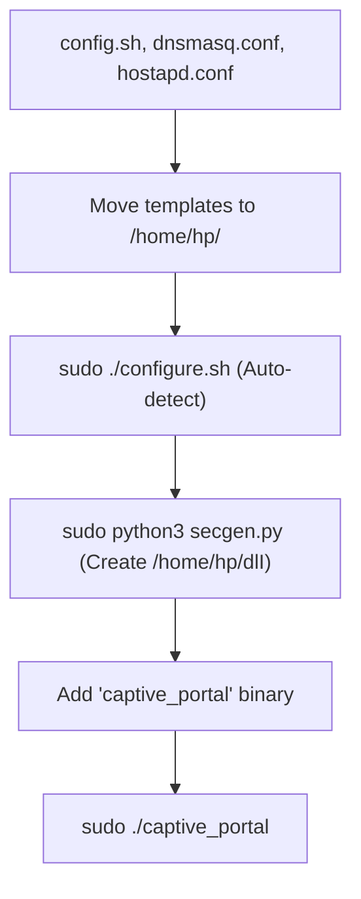

# 🎮 Gaming Kiosk Portal

## 🚀 Deployment Workflow
1.  **Prep**: Create `/home/hp/` and move `config.sh`, `dnsmasq.conf`, and `hostapd.conf` there.
2.  **Configure**: Run `sudo ./configure.sh` (updates files in `/home/hp/`).
3.  **License**: Run `sudo python3 secgen.py` to generate `/home/hp/dlI`.
4.  **Binary**: Move the `captive_portal` binary anywhere (e.g., your project folder).
5.  **Run**: `sudo ./captive_portal` (it looks for its 4 configs in `/home/hp/`).

## 📦 Required in /home/hp/
- `config.sh`, `dlI`, `hostapd.conf`, `dnsmasq.conf`

*System must have hostapd, dnsmasq, and iptables installed.*
