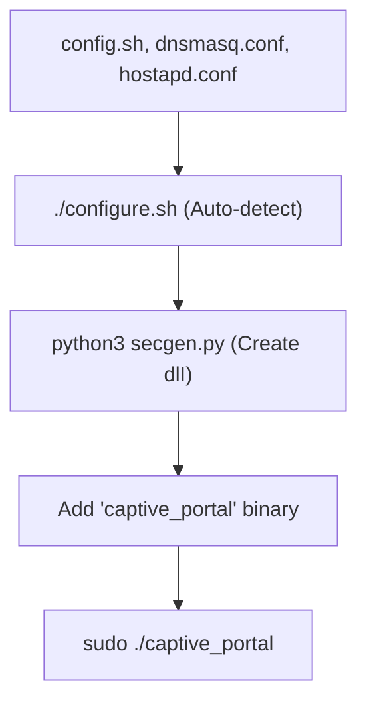

# 🎮 Gaming Kiosk Portal

Deploying to a new device:

## 🚀 Deployment Workflow
1.  **Prep**: Place `config.sh`, `dnsmasq.conf`, and `hostapd.conf` in your folder.
2.  **Configure**: Run `./configure.sh` to automatically detect WiFi interfaces and update settings.
3.  **License**: Run `python3 secgen.py` on the target machine to generate the `dlI` key.
4.  **Binary**: Move the `captive_portal` binary into the same folder.
5.  **Run**: Ensure all 5 files are present, then start:
    `sudo ./captive_portal`

## 📦 Required Folder Contents
- `captive_portal` (Executable)
- `config.sh` (Settings)
- `dlI` (Hardware Key)
- `hostapd.conf` (WiFi AP)
- `dnsmasq.conf` (DHCP/DNS)

*System must have hostapd, dnsmasq, and iptables installed.*
